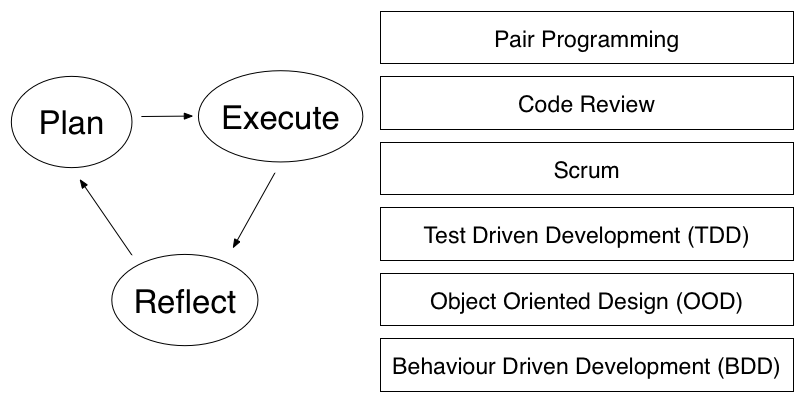

Introduction
===========

The Makers Academy experience is designed to emulate important aspects of working as a software developer and applying for software developer jobs.  Software developers don't spend hours sitting in lectures, either in their jobs or during job search. At work they have quick standup meetings each morning and then learn on the job, researching new things collaboratively with their peers.  Hunting for jobs, they do technical tests, attend interviews and work on open source projects. To reflect this the Makers Academy week is divided into three essential components:

1. Pair Programming Projects
2. Weekend Coding Challenges
3. Code Review

The weekend coding challenges are a simulation of the kinds of technical tests you will need to pass to get a job with a software company.  The code reviews and pair programming projects are a replica of the activities you will need to excel at as part of your job in a software company.

Overview of the Makers Academy Week
-----------------------------------

As part of the Makers experience you will be placed in a 'byte' which consists of between 6-12 students.  You will have a daily short 'standup' meeting with your byte in order to identify common problems and solutions.  Standups traditionally have people stand up rather than sit in order to ensure that the meeting is short.

A standup should consist of each member in turn answering three questions to the group of the form 'what is something I learned yesterday?', 'what do I hope to learn or improve today?', and 'what, if anything, is blocking me?'.  The ideal is to give only as much detail as necessary for everyone to be in the loop.  Any longer discussion should be moved to another meeting - potentially immediately after the standup.  It's the responsibility of everyone in the standup to ensure that long discussions do not break out, and that if longer discussions are needed that these are scheduled for later.

Weekend coding challenges are released every Friday and your attempted solution must be submitted via pull request by Monday at 9am.  It does not matter if you 'complete' the challenge; submit your solution with as much code as you have working.  Also note that you can submit the pull request as early as you like; subsequent pushes to the branch will automatically update the pull request.  You will receive automated feedback on your solution which will appear on the pull request.  Mondays are code review days and you will receive both peer and coach feedback on your code.

Tuesdays, Wednesday and Thursdays are pair-programming project days.  You will work in a pair with another student on a coding project. You will swap pair partners each day.  The following diagram summarizes the flow of the week:

After the standup there may be time for a quick Q&A, with the coach.  However, if there is a need for a more detailed workshop on a particular topic, then we will run this for all of the students that wish to attend (probably in the afternoon).

Overview of the Course Week
-------------------------

The weekly structure is maintained consistently for the first five weeks, then gradually removed:

**Junior Portion**

1             | 2          | 3           | 4                | 5          | 6            |
--------------|------------|-------------|------------------|------------|--------------|
Boris Bikes   | Oystercard | Battles Web | Bookmark Manager | JavaScript | Project Week |

**Senior Portion**

7                  | 8     | 9         | 10             | 11             | 12            |
-------------------|-------|-----------|----------------|----------------|---------------|
Further JavaScript | Rails | Makerthon | Final projects | Final projects | Hiring Week   |

Each week there will be learning objectives relating to the particular project and pre-reading materials based on the learning objectives.

* Office Hours (9am-9pm)
* Coach Availability (930am-noon - 2:30pm-4pm)
  - supporting you becoming active learners
  - wean yourself off the coaches
* Weekly schedule - subject to change, just like the world of technology
* Be proactive - if you don't have something that you need, get it

You:

* MUST install slack desktop client
* MUST create a StackOverflow account
* REALLY SHOULD post or upvote on SO at least once a week
* MUST use sequence of asking for help (pair partner, peer, senior, slack-overflow, coach)
* MUST submit code challenges
* MUST do byte planning, standups and retrospectives
* MUST show up

Ultimately we want all of you to be able to manage the whole web development stack, completely independently of us.

The Agile Process
---------------

The Agile process is the heart of Makers Academy. Agile sits in contrast to the 'big design up-front' approach of "give us £8M to build a system and we'll see you in two years with something that might work".

There are many techniques associated with agile development such as programming in pairs, performing code reviews, scrum, kanban, test driven development (TDD) and behaviour driven development (BDD); however none of these alone "is" Agile.  They are all techniques that might be selected in the Agile planning process.  Agile itself does not specify that one particular technique or another should be used.  Agile specifies that a team should pick from the available techniques, execute the plan, and then reflect on the extent to which the team moved towards their goals, ideally with a quantifiable measurement of their progress.  During the reflection phase different techniques can be dropped, started, modified, tweaking; whatever the team thinks will best help them move towards their goal.

This doesn't mean that changes should be made carelessly or quickly.  It is best to avoid making too many changes in the process at one time because otherwise it is difficult to determine which change led to any benefits or deficits.  The critical component is that all members of the team are clear about what is being changed for what reason and everyone has agreed to give the changes a try.

[Back to course outline](course_outline.md)
