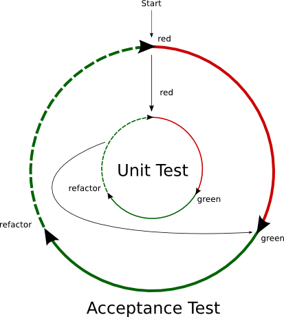
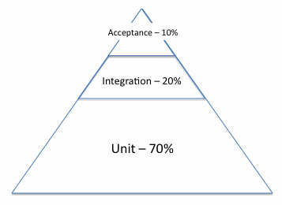

# Behaviour Driven Development

## What is BDD?
**Behaviour Driven Development (BDD)** is closely related to **TDD** and is often used as part of an *Agile* development process. Agile and BDD work well together to help us communicate with stakeholders effectively, and quickly deliver working software to end users.  This software can then be tested rapidly to ensure it meets the stakeholder needs and creates the desired business benefit.

BDD is a process that relates *Acceptance Tests* (also known as *Feature Tests*) with *Unit Tests*.  An Acceptance Test describes a high-level behaviour of the system and is usually closely related to a **User Story**.  A Unit Test is a low-level test of a single component, usually created using TDD.

## User Stories in BDD

We start to describe the *required behaviour* of our system by considering how and why users will interact with it.  These interactions will have been captured previously using user stories.  Read the [User stories pill :pill:](../pills/user_stories.md).  The next step in a BDD process is to choose a small number of stories to focus on: the ones that deliver the **key value** (greatest value to users). Then, we decide on one specific story to start with.


## The BDD Cycle

```
User Stories -> Feature Tests -> Unit Tests -> Features
               <--- Emergent Domain Model --->
```

BDD is all about the process of moving from User Stories to Feature (a.k.a. *Acceptance*) Tests, then from Feature Tests to Unit Tests, and then from Unit Tests to actual Features. Critically, though, BDD works as a **cycle**. The whole BDD process is designed to work *iteratively*, where the analysis of a previous round *feeds back* into the current one.

Here is an example of the *BDD Cycle* in use:

>We switch from high-level acceptance tests to lower-level unit tests, whereby we specify the precise individual operations that the objects in our domain can perform.  Having written a specification for an individual object with a test, we'll implement *part* of the object itself and then jump back up to see if the system has the high level behaviour specified in our user story.  

>We'll keep fleshing out our domain with unit tests, and then jumping back up to see the stories coming to life at the acceptance test level.  Sometimes we'll want to step back and consider 'refactoring' the domain model and the code that supports it in order to better support the delivery of value to the end user through user stories.



The diagram above shows the BDD testing cycle, broken down into the red-green-refactor steps associated with testing both acceptance tests and unit tests.  Red refers to tests failing, green refers to them passing, and then refactor refers to cleaning up the code afterwards, adjust the domain model and so forth, that we can do with confidence because any time we make a change we can run our tests to check we haven't broken something.  This is critical as even tiny changes can break things in unexpected places when programming.  The BDD cycle shown above indicates how we start with a failing acceptance test, we create a related failing unit test, fix and refactor at the unit level and then fix and refactor at the acceptance level.  We'll walk through this entire cycle in this project.

To be specific about the types of tests we'll be writing; unit tests check very small aspects of functionality on individual objects, ideally in complete isolation of each other.  Feature or Acceptance tests (we'll use the two terms interchangeably) check that the correct high level behaviour is provided by the system.  In complex systems we can have a range of other types of tests between the extremes of umbrella-like feature tests and low level independent unit tests.  Intermediate tests are often called 'integration-tests'; tests that might check the interaction of a few objects, but might not necessarily check if a complete user story is supported.  In this tutorial things are relatively simple so anything that is complex enough to check interacting objects is likely to be a feature test, so we'll be able to use the terms integration and feature test somewhat interchangeably, but it's good to understand the difference between these three types of tests as indicated by the testing pyramid:



This pyramid diagram indicates the likely distribution of tests we have in anything other than a small project.  It's not prescriptive but its common to have a small number of relatively slow running acceptance tests, a slightly larger number of integration tests and then a large number of small fast unit tests.  Having a balanced testing pyramid is about getting the right amount of benefit from each type of test.  Unit tests are fast so we can have a lot of them, and then they are great at checking individual behaviour, but won't check the system does what the user wants, or that objects are interacting correctly. That's what the slower running integration and acceptance tests do, but because they run more slowly we can't afford to run so many each time we make any change to our code.
